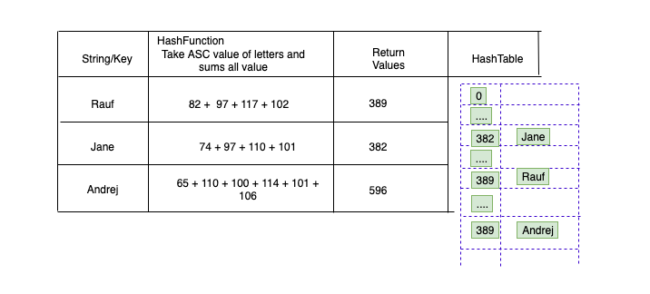

# Hashing

Hashing is a way of storing data in a manner, that data can be access very quickly. It usually is done by a technique called `HashTable`. The performance of HashTable is not so good, specifically for search operations.
Rather discuss pros and cons lets dive into `HashTable` and we will discuss more, about fast HashTable on later stages

## Introduction

`HashTable` uses an array and works more like a dictionary with key and value pairs, but the determination of key done by `Hashfunction` and distribute evenly into buckets.
A `HashFunction` takes a string as key and returns a number and saves it into a corresponding bucket.
The below image can demonstrate a `Hashfunction`.



!> In Javascript, there is a limitation of array elements creation. Due to JS memory limit, the maximum number of array elements can be
2^32 - 1 or 4294967295

So, we have to carefully distribute elements.

!> Another, the deficiency is called `Collision`, it happens when two HashKey assigned to the same value

Later we will discuss how to avoid `Collision`.

## Implementation

### The constructor

```js
function HashTable() {
  this.table = new Array(197);
  this.simpleHash = simpleHash;
  this.showDistro = showDistro;
  this.put = put;
}
```

### How to choose a HashFunction

It depends on data type.
If the data type is `integer`, the easiest HashFunction will be `HashKey % Array.length`.
There is a chance of having wrong key assign, to avoid that error,

!> Always use prime numbers as a array size.

Like in our `HashTable()` constructor, 197 is the length of the array and 197 is a prime number.

Another data type is `string`, this is difficult than integer. A simple function can be, covert string into a ASCII value, as our image shows.

```js
function Hashfunction(str) {
  var sum = 0;
  for (var i = 0; i < str.length; ++i) {
    sum += str.charCodeAt(i);
  }
  return sum % this.table.length;
}
```

##### Now Lets go back to our implementation

Full Code

```js
function HashTable() {
  this.table = new Array(197);
  this.simpleHash = simpleHash;
  this.showDistro = showDistro;
  this.put = put;
}

// Put data into correspond array position
function put(data) {
  var pos = this.simpleHash(data);
  this.table[pos] = data;
}

//Get data from Hashtable
function get(key) {
  return this.table[this.simpleHash(key)];
}

// Hasing function return ANSCII value for string
function simpleHash(data) {
  var total = 0;
  for (var i = 0; i < data.length; ++i) {
    total += data.charCodeAt(i);
  }
  return total % this.table.length;
}

//  Printing Hash table data
function showDistro() {
  var n = 0;
  for (var i = 0; i < this.table.length; ++i) {
    if (this.table[i] != undefined) {
      console.log(i + ": " + this.table[i]);
    }
  }
}
```

##### Testing

```js
var someNames = [
  "David",
  "Jennifer",
  "Donnie",
  "Raymond",
  "Cynthia",
  "Mike",
  "Clayton",
  "Danny",
  "Jonathan",
];
var hTable = new HashTable();
for (var i = 0; i < someNames.length; ++i) {
  hTable.put(someNames[i]);
}
hTable.showDistro();


// Output
35: Cynthia
45: Clayton
57: Donnie
77: David
95: Danny
116: Mike
132: Jennifer
134: Jonathan

```

Above example is a effective example of HashTable implementation but we can do better than that.

### More effective implementation

Lets re-write the HashFucntion `simpleHash()` function into something more effective and can eliminate collision.

Here, we are using `Horner's method` and define a initial prime const and divide the key with this.

!> Horner's method return polynomial value at any given point

```js
function betterHash(string, arr) {
  const H = 37;
  var total = 0;
  for (var i = 0; i < string.length; ++i) {
    total += H * total + string.charCodeAt(i);
  }
  total = total % arr.length;
  return parseInt(total);
}
```
