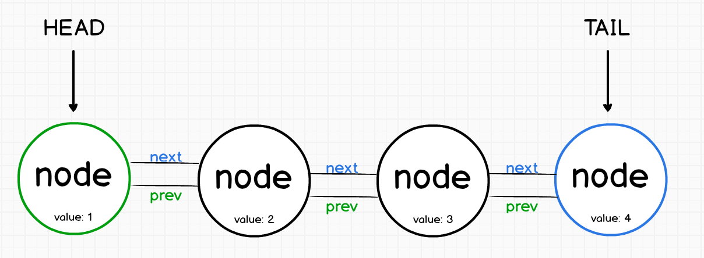

# Linked-List

Sometime array operation can be slow and laggy due to the fact, javascript engine treat an array as an object.
In some specific case we can use Linked-List as more fast alternative.

!> Almost all one dimensional array operation can be implement in Linked-List

## What is Linked-List

A Linked List is a collection of object call `nodes`. Each nodes linked to successor node and refer another node call `link`
Beginning of nodes call `head` and end called `tail`



A really important fact to understand, unlike array position reference

!> In Linked-List elements are referenced by their relationship.

General used terminology , `node2` follows `node1` and end of a linked-list point as a `null node`

Add or remove nodes in linked-list is fairly easy than array. We do not have to care of position.

## Implementation

We will define linked-list into two classes. `Node` class will add new nodes into linked-list and `LinkedList` class will provide basic functions

#### Node class

Lets implement `Node` class. It will consist of two properties, `element` and `next`

```js
function Node(element) {
  this.element = element;
  this.next = null;
}
```

#### Linked-List class

This class will provide basic functionalities, implementation of constructor should look like

```js
function LinkedList() {
  this.head = new Node("head");
  this.find = find;
  this.insert = insert;
  this.remove = remove;
  this.display = display;
}
```

#### Insert new nodes

For implementing `insert` function we have to define previous and next node.

To insert a node after an existing node, we first have to find `after` node. To do this, we create helper function,

`find()`, which searches through the linked list looking for the specific data, when the data have been found, function will return node storing the data.

```js
function find(item) {
  var currNode = this.head;
  while (currNode.element != item) {
    currNode = currNode.next;
  }
  return currNode;
}
```

After we find current node. we will insert an element into it. Lets implement `insert()` function.

```js
function insert(newElement, item) {
  var newNode = new Node(newElement);
  var current = this.find(item);
  newNode.next = current.next;
  current.next = newNode;
}
```

Now it is time for testing, for testing we need some function which will display the elements of our linked-list.

```js
function display() {
  var currNode = this.head;
  while (!(currNode.next == null)) {
    console.log(currNode.next.element);
    currNode = currNode.next;
  }
}
```

Lets test our linked list without `remove()` function we will implement it later.

```js
var menus = new LinkedList();
cities.insert("pasta", "head");
cities.insert("burger", "pasta");
cities.insert("coffee", "burger");
cities.display();

// output
pasta;
burger;
coffee;
```

So far so good! Now lets move to next section `remove`

#### Remove node

In order to remove the node from Linked-list we have to find the previous node. For doing this we need one more helper function `findPrev()`

Lets implement,

```js
function findPrevious(item) {
  var currNode = this.head;
  while (!(currNode.next == null) && currNode.next.element != item) {
    currNode = currNode.next;
  }
  return currNode;
}
```

This function is basically traverse the linked-list, stopping into each node to see if the next node stores the data that is to be removed, when the data is found, the function return the node.

Now let's implement `remove()` function

```js
function remove(item) {
  var prevNode = this.findPrevious(item);
  if (!(prevNode.next == null)) {
    prevNode.next = prevNode.next.next;
  }
}
```

You may have find this line little strange!

```js
prevNode.next = prevNode.next.next;
```

!> Here! we are skipping over the node we want to remove and linking the previousNode with nextNode. We are doing this for maintaining continuity within linked-list

Lets test our remove functionality.

```js
var cities = new LinkedList();
cities.insert("Paris", "head");
cities.insert("Berlin", "Paris");
cities.insert("Prague", "Berlin");
cities.insert("Delhi", "Prague");
cities.display();
console.log("after removal: ");
cities.remove("Berlin");
cities.display();

// output
Paris
Berlin
Prague
Delhi
after removal:
Paris
Prague
Delhi

```

!> Full Code

```js
function Node(element) {
  this.element = element;
  this.next = null;
}

// mainfunction
function LinkedList() {
  this.head = new Node("head");
  this.find = find;
  this.insert = insert;
  this.display = display;
  this.findPrevious = findPrevious;
  this.remove = remove;
}

// remove node
function remove(item) {
  var prevNode = this.findPrevious(item);
  if (!(prevNode.next == null)) {
    prevNode.next = prevNode.next.next;
  }
}
// find previous node
function findPrevious(item) {
  var currNode = this.head;
  while (!(currNode.next == null) && currNode.next.element != item) {
    currNode = currNode.next;
  }
  return currNode;
}

// display nodes
function display() {
  var currNode = this.head;
  while (!(currNode.next == null)) {
    console.log(currNode.next.element);
    currNode = currNode.next;
  }
}

// find specific node
function find(item) {
  var currNode = this.head;
  while (currNode.element != item) {
    currNode = currNode.next;
  }
  return currNode;
}

// insert node
function insert(newElement, item) {
  var newNode = new Node(newElement);
  var current = this.find(item);
  newNode.next = current.next;
  current.next = newNode;
}
```
